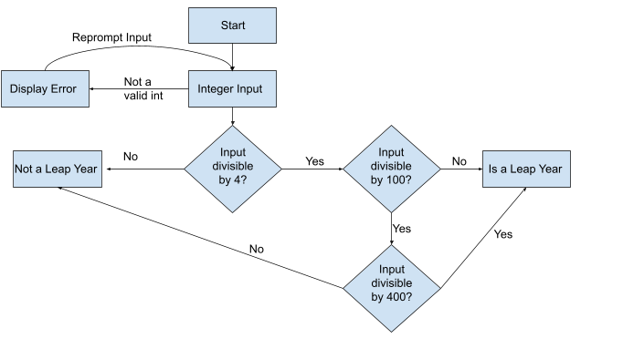

# HW2
Code for CS362 Homework 2
Ryan Smith
smithry9@oregonstate.edu

a) I already added error checking in my submission for homework 1 so there wasn't anything to change

b) The file ryan_smith_hw2.py is the program with error checking

c)

